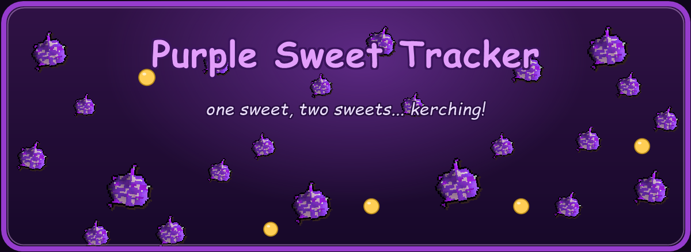

**Counts the purple sweets you eat, what they're worth, and kerchings on every one.**

---

Purple Sweet Tracker keeps a running count of the purple sweets you eat and their Grand Exchange
value, both all-time and for the current session, and plays a sound on each one. Show the numbers
however suits you - a draggable overlay, an item-timer style infobox, or just the side panel - and
it keeps counting quietly in the background.

## Features

🍬 **Sweets eaten and their value**

All-time and per-session counts of the purple sweets you eat, with their GP value and a
sweets-per-hour rate. Your all-time totals are saved between sessions.

🔊 **Kerching on every sweet**

A sound each time you eat one - the Grand Exchange coin "kerching" by default, with a few other
game sounds to choose from. It plays at your in-game sound-effects volume, and you can switch it off.

🖥️ **Overlay, infobox, or both**

Show a draggable, snappable overlay box, an item-timer style infobox (set to the amount eaten or the
GP value), both, or neither. Either one can show your lifetime totals or just this session, and the
overlay's lines and colour are yours to set.

🧰 **Side panel**

A panel with your all-time and session stats and rate, a reset button, and a copy-to-clipboard
button for sharing your numbers.

🔔 **Milestone pings**

An optional chat message and notification every set number of sweets, so you know when you hit a
round total.

## License

BSD 2-Clause. Old School RuneScape and purple sweets are © Jagex Ltd; this is a fan-made plugin, not
affiliated with or endorsed by Jagex. The infobox uses the in-game purple sweets sprite.
